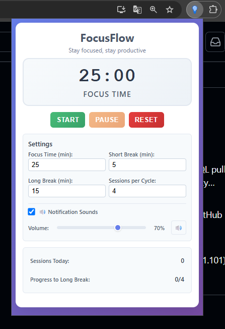
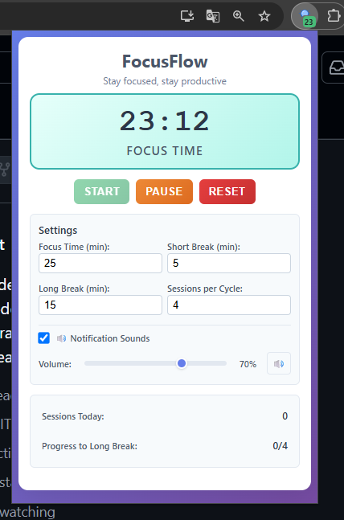

# FocusFlow - Chrome Extension

A modern Pomodoro timer Chrome extension designed to help you stay focused and productive with an intuitive interface and comprehensive features.

## 📱 Interface Preview



*Clean and intuitive interface with customizable settings*

  

*Active focus session with real-time countdown*

## ✨ Features

### 🎯 Core Functionality
- **Full Pomodoro Cycle**: Automatic transitions between focus time, short breaks, and long breaks
- **Customizable Timers**: Adjustable focus time (1-60 min), short break (1-30 min), and long break (5-60 min)
- **Smart Session Management**: Configurable sessions per cycle before long break (2-8 sessions)
- **Intelligent Reset**: Always returns to focus time regardless of current state

### 🔊 Audio & Notifications
- **Advanced Sound System**: Binaural frequency generation for different transitions
- **Multiple Sound Types**: Distinct audio patterns for work→break, break→work, and long break
- **Background Audio**: Works even when popup is closed using offscreen documents
- **Volume Control**: Adjustable volume with test functionality
- **System Notifications**: Chrome notifications with contextual messages

### 📊 Progress Tracking
- **Daily Statistics**: Sessions completed today counter
- **Cycle Progress**: Visual progress toward next long break
- **Persistent Data**: All progress saved across browser sessions

### 🎨 Modern UI/UX
- **Responsive Design**: Compact layout with optimal visibility
- **Visual States**: Different color schemes for focus and break modes
- **Real-time Updates**: Live timer display and badge updates
- **Smooth Animations**: Pulse effects and smooth transitions
- **No-Scroll Interface**: Everything visible at once

## 🚀 Default Settings

- **Focus Time**: 25 minutes
- **Short Break**: 5 minutes  
- **Long Break**: 15 minutes
- **Sessions per Cycle**: 4 sessions before long break
- **Sound Notifications**: Enabled with 70% volume

## 📦 Installation

1. **Clone the repository**:
   ```bash
   git clone [repository-url]
   cd focusflow
   ```

2. **Load in Chrome**:
   - Open Chrome and navigate to `chrome://extensions/`
   - Enable "Developer mode" toggle in the top right
   - Click "Load unpacked" and select the project folder
   - The FocusFlow icon will appear in your Chrome toolbar

## 🎮 Usage

### Basic Operation
1. **Start Timer**: Click the FocusFlow icon and press "Start"
2. **Pause/Resume**: Use "Pause" button to temporarily stop
3. **Reset**: Use "Reset" to return to focus time from any state

### Customization
1. **Adjust Times**: Modify focus, break, and long break durations
2. **Set Cycle Length**: Choose how many sessions before long break
3. **Configure Audio**: Toggle sounds and adjust volume
4. **Test Settings**: Use the test sound button to preview audio

### Monitoring Progress
- **Badge Display**: Shows remaining minutes on extension icon
- **Session Counter**: Track daily completed sessions
- **Cycle Progress**: See progress toward next long break

## 🏗️ Project Structure

```
focusflow/
├── manifest.json       # Extension configuration and permissions
├── popup.html         # Main UI interface
├── popup.js           # Timer logic and UI interactions  
├── popup.css          # Modern styling and responsive design
├── background.js      # Service worker for timer management
├── offscreen.html     # Audio playback document
├── offscreen.js       # Audio generation and playback logic
├── icons/             # Extension icons (16px, 48px, 128px)
├── sounds/            # Audio files directory (for future use)
└── README.md          # Project documentation
```

## ⚙️ Technical Implementation

### Architecture
- **Service Worker Background**: Persistent timer state management
- **Popup Interface**: Reactive UI with real-time updates
- **Offscreen Audio**: CSP-compliant audio playback system
- **Chrome Storage**: Persistent settings and session data

### Audio System
- **Binaural Frequencies**: Programmatically generated audio tones
- **Multiple Patterns**: Different beep patterns for various transitions
- **Fallback Support**: Multiple audio implementation strategies
- **Background Playback**: Works without active popup

### Data Persistence
- **Local Storage**: Timer state and real-time data
- **Sync Storage**: User preferences and settings
- **Session Management**: Daily session counters with date tracking

## ✅ Development Status

- ✅ **Core Timer**: Full Pomodoro cycle implementation
- ✅ **Audio System**: Binaural frequency generation
- ✅ **Notifications**: System notifications and badge updates
- ✅ **Settings**: Complete customization options
- ✅ **UI/UX**: Modern, responsive interface
- ✅ **Persistence**: Full state and settings management
- ✅ **Background Operation**: Continues running when popup closed
- ✅ **Session Tracking**: Daily statistics and cycle progress
- ✅ **CSP Compliance**: Secure code execution

## 🛠️ Technologies Used

- **Frontend**: HTML5, CSS3 (modern features), Vanilla JavaScript
- **Chrome APIs**: Storage, Notifications, Offscreen, Runtime
- **Audio**: Web Audio API with programmatic tone generation
- **Architecture**: Service Worker pattern for background processing
- **Styling**: CSS Grid, Flexbox, Custom Properties, Animations

## 🔧 Development

### Prerequisites
- Chrome Browser (latest version recommended)
- Basic understanding of Chrome Extension APIs

### Local Development
1. Make changes to source files
2. Reload extension in `chrome://extensions/`
3. Test functionality across different scenarios

### Version Control
The project uses Git with semantic commit messages:
- `feat:` New features
- `fix:` Bug fixes  
- `refactor:` Code improvements
- `style:` UI/UX changes

## 🤝 Contributing

This project demonstrates modern Chrome extension development practices. Contributions, suggestions, and feedback are welcome!

## 📄 License

This project is licensed under the **MIT License** - see the [LICENSE](LICENSE) file for details.

### 🎓 Educational Open Source Project

Originally created as a learning project to explore Chrome Extension development. Perfect for:

- ✅ **Learning** Chrome Extension APIs and architecture
- ✅ **Understanding** Service Worker patterns and background processing  
- ✅ **Studying** real-time UI updates and state management
- ✅ **Exploring** Web Audio API and binaural frequency generation
- ✅ **Portfolio** inclusion and professional development

### 🤝 Contributing & Usage

Feel free to:
- **Fork** this repository for your own projects
- **Study** the implementation for educational purposes
- **Modify** and adapt the code to your needs
- **Contribute** improvements via pull requests
- **Use** in commercial or personal projects

**Attribution appreciated but not required!** 🙏

### 🌟 Support the Project

If this project helped you learn something new, consider:
- ⭐ **Starring** the repository
- 🍴 **Forking** for your own experiments  
- 📝 **Sharing** your improvements
- 💬 **Discussing** Chrome Extension development 